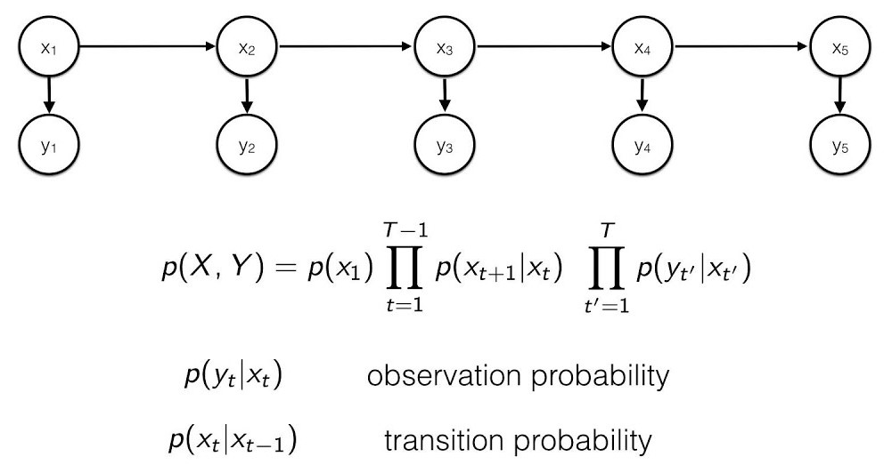

# NLP201 Clothing Composition Parsing
NLP201 Frugal Innovation &amp; Computation Linguistics. Unit #10. Extract entities, relationships

# Contexte et objectif

<i>La mode passe certes, mais les impacts environnementaux et sociaux qu'elle provoque s'inscrivent dans le temps (...) 4 milliards de tonnes d'équivalent CO2 par an, ce sont les émissions générées par l'industrie textile (vêtements et chaussures). C'est plus que l'impact des vols internationaux et le trafic maritime réunis. En 2050, le secteur textile émettrait même 26 % des émissions globales de GES si les tendances actuelles de consommation se poursuivent.</i> - [La mode sans dessus-dessous](https://multimedia.ademe.fr/infographies/infographie-mode-qqf/), infographie de l'ADEME (avril 2022).

[Carbonfact](https://www.carbonfact.com/) aide ainsi les entreprises de la mode à calculer l'empreinte carbone des vêtements pour décarboner l'industrie. Ces indicateurs sont effectuées avec un logiciel d'analyse du cycle de vie sur-mesure. <i> Une des principales difficultés pour une entreprise comme Carbonfact vient du fait que les données à analyser des clients sont hétérogènes, stockés de manières différentes, avec des conventions de noms différentes pour les matériaux, des attentes différentes quant aux composants qui composent un produit, etc. </i> - Max Halford's blog [NLP at Carbonfact: how would you do it?](https://maxhalford.github.io/blog/carbonfact-nlp-open-problem/)

Dans ce contexte, l'objectif du TD est d'<b>extraire, à partir de texte, les composants, matériaux et proportions nécessaires pour fabriquer un produit</b> et ainsi permettre à [Carbonfact](https://www.carbonfact.com/) d'évaluer son empreinte carbone. L'approche proposée utilise des méthodes de linguistique computationnelle et un algorithme d'apprentissage automatique relativement simples pour tenter d'automatiser l'analyse du cycle de vie pour différents clients. Il s'agit donc de convertir du texte dans un schéma structuré. Par exemple on souhaite convertir `lace 87% nylon 13% spandex; mesh: 95% nylon 5% spandex` en un format structuré comme dans l'exemple ci-dessous:

```
{
    "lace": [
        {
            "material": "nylon",
            "proportion": 87.0
        },
        {
            "material": "spandex",
            "proportion": 13.0
        }
    ],
    "mesh": [
        {
            "material": "nylon",
            "proportion": 95.0
        },
        {
            "material": "spandex",
            "proportion": 5.0
        }
    ]
}
```

Ici, la dentelle (`lace`) et la maille (`mesh`) sont des noms de composants qui constituent un article vestimentaire. Ces composants sont faits de différents matériaux dont on peut trouver une liste [ici](https://maxhalford.github.io/files/datasets/nlp-carbonfact/materials.txt).

Le jeu de données complet, en accès libre, est constitué de 600 pairs (input, output), accessibles aux liens ci-dessous:
* [inputs.txt](https://maxhalford.github.io/files/datasets/nlp-carbonfact/inputs.txt)
* [outputs.json](https://maxhalford.github.io/files/datasets/nlp-carbonfact/outputs.json)

# Modèle et baseline

La baseline de Carbonfact, détaillée dans le [blog de Max](https://maxhalford.github.io/blog/carbonfact-nlp-open-problem/), est pragmatique. Elle n'est pas basée sur de l'apprentissage automatique mais sur des règles. L'inconvénient est que la solution n'est pas générique (...) si le client ajoute plus de données à son catalogue, il faut probablemement éditer le code pour gérer de nouveaux cas.

Le modèle proposé dans ce TD est constitué de deux modules:
* Le premier permet de segmenter les chaines de caractères, c'est à dire labeliser chaque caractère comme faisant partie d'un composant, d'un matériaux, d'une proportion ou autre (4 choix par caractères). Nous utilisons pour celà un [modèle de Markov caché](https://fr.wikipedia.org/wiki/Mod%C3%A8le_de_Markov_cach%C3%A9) (HMM en anglais) illustré ci-dessous où chaque état observé <i>y</i> est un caractère et chaque état caché <i>x</i> est un des 4 labels. Les probabilités d'émissions et de transitions sont initialisées à l'aides des données et l'[algorithme de Viterbi](https://fr.wikipedia.org/wiki/Algorithme_de_Viterbi) est utilisé pour trouver, à posteriori, la séquence la plus probable d'états cachés (composant, matériaux, proportion ou autre)
* Une fois la chaine de caractère segmentée, nous pouvons extraire les entités qui nous intéressent (les composants, matériaux, proportions) et les relations entre vêtements, composants, matériaux et proportions pour l'analyse du cycle de vie.



# Installation 

Cloner ce projet avec `git clone`

Créer un environnement Python 3.8+, par exemple avec Anaconda `conda create -n miashs python=3.8`

Activer l'environment créé avec `activate miashs` et installer les dépendances avec `pip install -r requirements.txt` or `conda install --file requirements.txt`

# Assignment

Completer les 3 blocks marqués TODO dans `notebook/homework.ipynb` et évaluer votre méthode. En bonus, vous pouvez considérer les suggestions de la section "Pour aller plus loin" (ci-dessous).

# Résultats 

## Train/test accuracy

Nous avons séparé les 600 exemples du jeu de donné original en deux sous-ensembles pour initialiser (resp. tester) le modèle avec 90% (resp. 10%) des exemples. Les résultats en terme d'accuracy sont reportés ci-dessous.

| Méthode         | Baseline (rule-based)| ML approach (char HMM) |
|-----------------|:--------------------:|-----------------------:|
| Accuracy (train)|  100%                | 76.7%                  |
| Accuracy (test) |  100%                | 76.7%                  |

Note: Les 23% d'erreurs peuvent être détéctés facilement (composant ou matériaux non reconnu, somme des proportions différent de 100) pour qu'un humain puisse les corriger. Sur 600 exemples, cela signifie que l'algorithme peut automatiquement extraire les relations pour 460 cas et 140 cas doivent être revus par un humain. 

Par comparaison, sur des sous-ensembles différents pour entrainer/tester, le modèle [GPT-3 pré-entrainé et affiné sur les données](https://maxhalford.github.io/blog/garment-parsing-gpt3/) atteint une accuracy de 84.3%. Cependant, ce dernier modèle n'est pas en accès libre gratuitement et utilise entre 18 millions et 18 milliards fois plus de paramètres que le modèle de Markov caché proposé (< 200 paramètres). Il est par ailleurs plus lent par comparaison. Enfin, sachant qu'entrainer ce genre de modèle peut consommer l'équivalent de <i>5 voitures durant leur cycle de vie.</i> ([Technology review, 2019](https://www.technologyreview.com/2019/06/06/239031/training-a-single-ai-model-can-emit-as-much-carbon-as-five-cars-in-their-lifetimes/)) et dans un contexte où on cherche à décarboner l'industrie, à tendre vers une société plus sobre, l'utilisation d'un modèle aussi complexe pour des chaines de caractères aussi petites peut sembler un paradoxe.

## Analyse des erreurs


# Pour aller plus loin

L'approche proposée est relativement simple et peut donc être rendu plus complexe pour gagner en précision, en analysant quand/comment le modèle se trompe. En particulier le modèle initialisé pourrait être entrainé/ajusté sur les données en maximisant la vraisemblance avec l'[algorithme d'Espérance-Maximisation](https://fr.wikipedia.org/wiki/Algorithme_esp%C3%A9rance-maximisation). L'ajout de bruit (insertion, suppression, remplacement de caractère) et de simples méthodes de post-processing des composants/matériaux (par exemple avec char-tfidf et cosine similarity) peut rendre l'approche plus robuste aux erreurs de frappe. Enfin, plutôt que d'utiliser des caractères comme états observés, le modèle pourrait utiliser des ngrams (2, 3+ caractères) ou encore des représentations factorisées de caractères (LDA, NMF, pLSI) pour prendre en compte les corrélations entre ceux-ci.

# Remerciements


